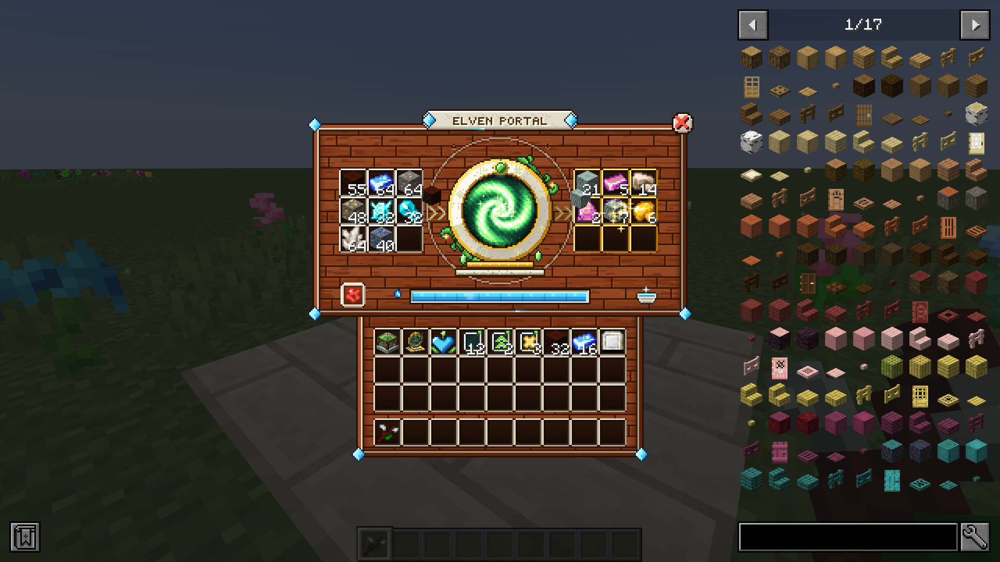
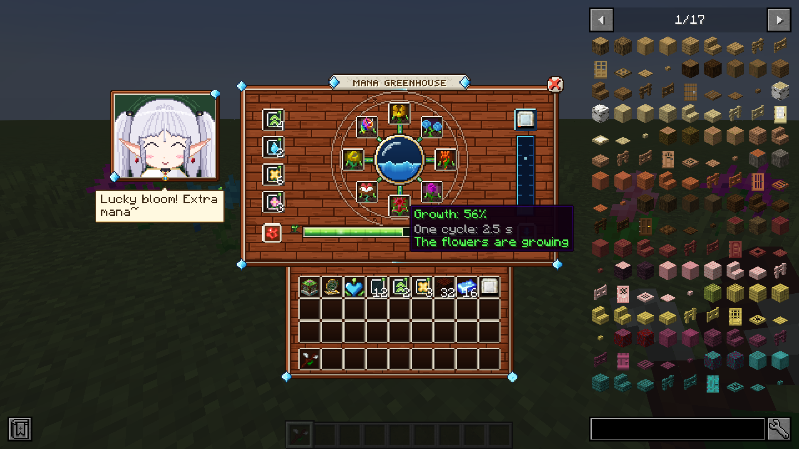
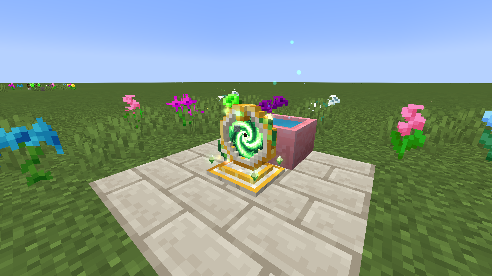
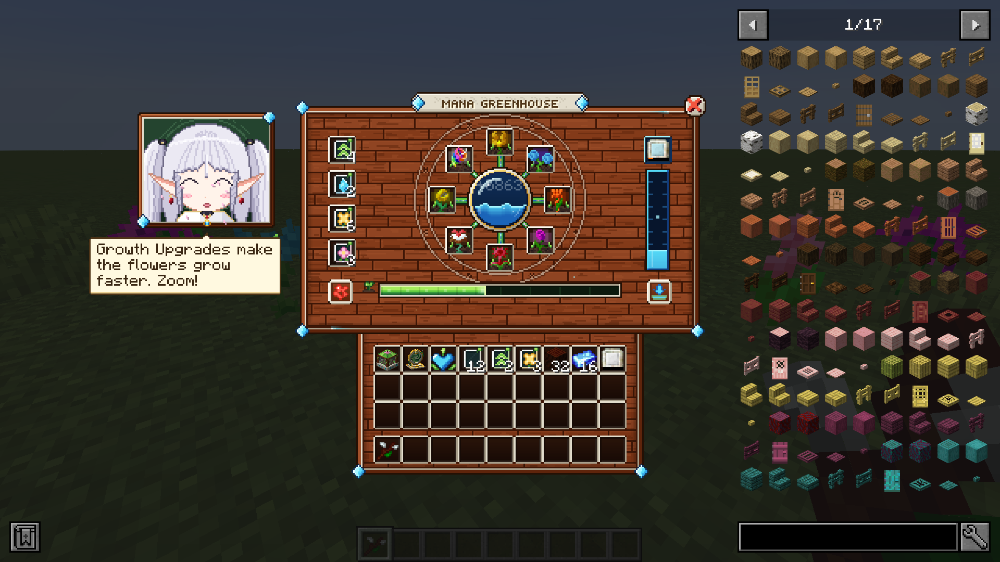
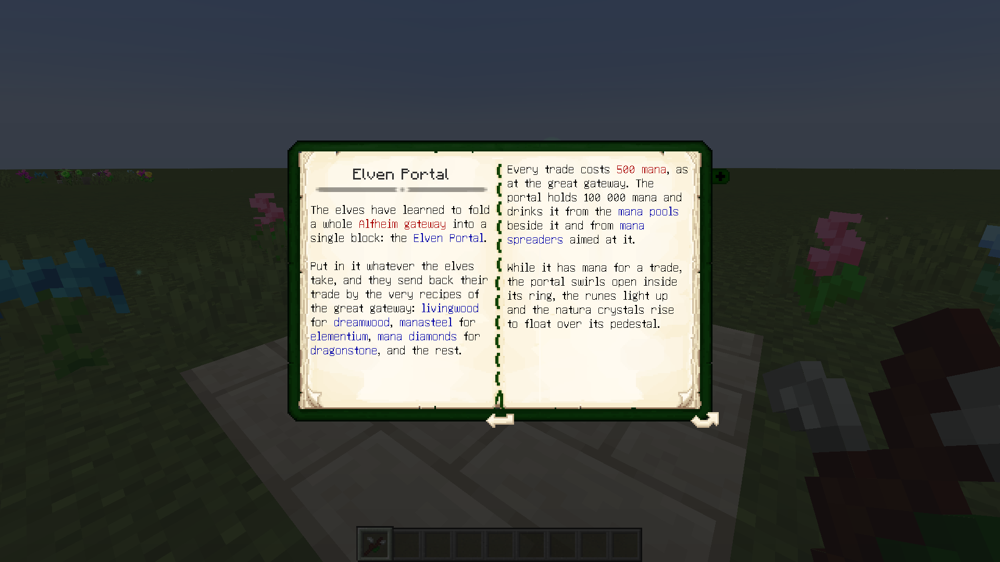
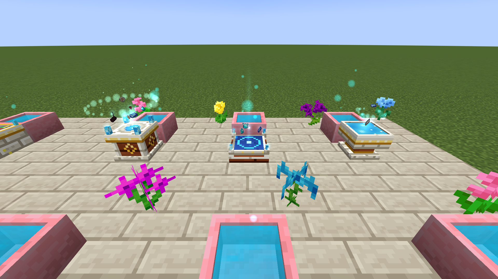
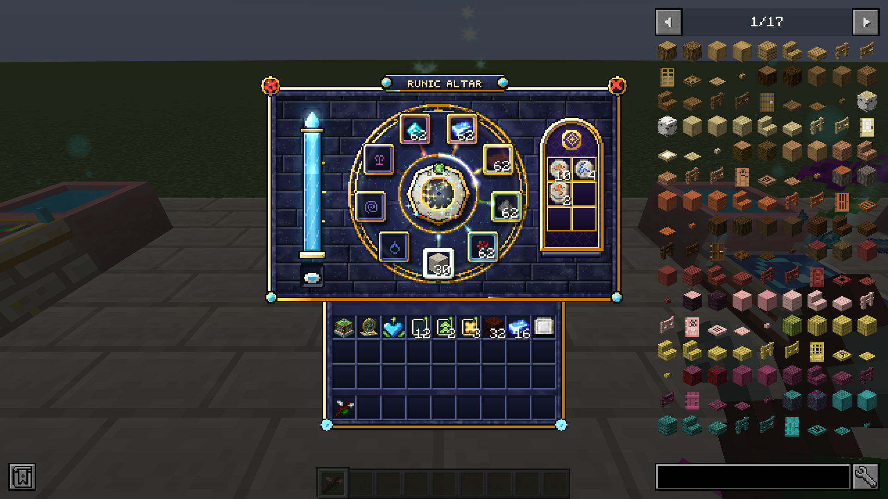
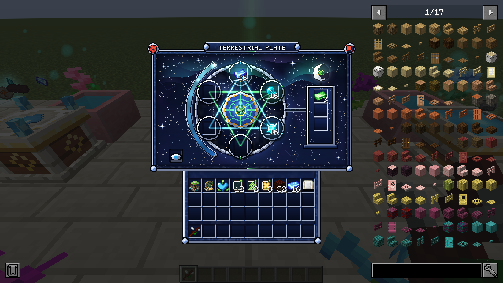
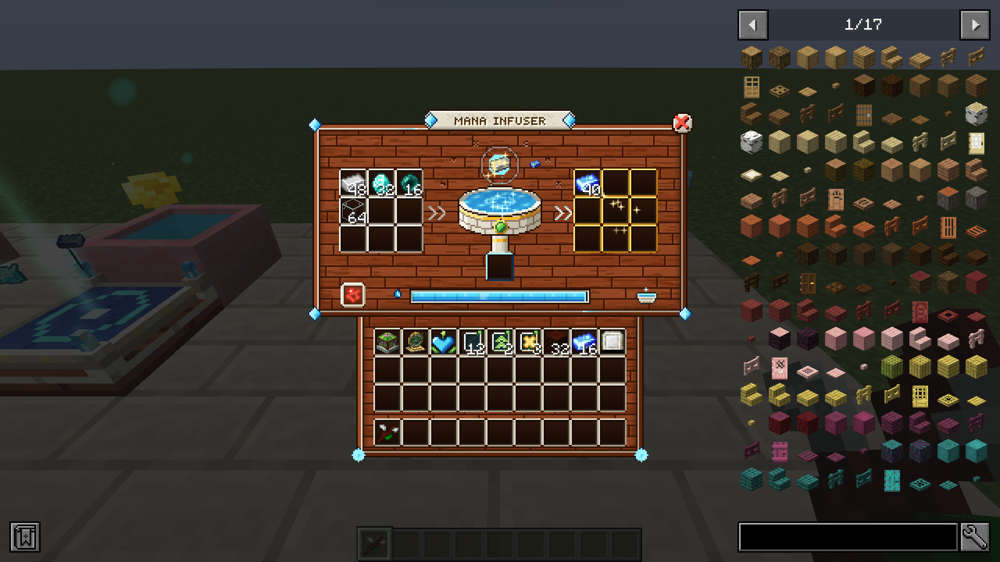
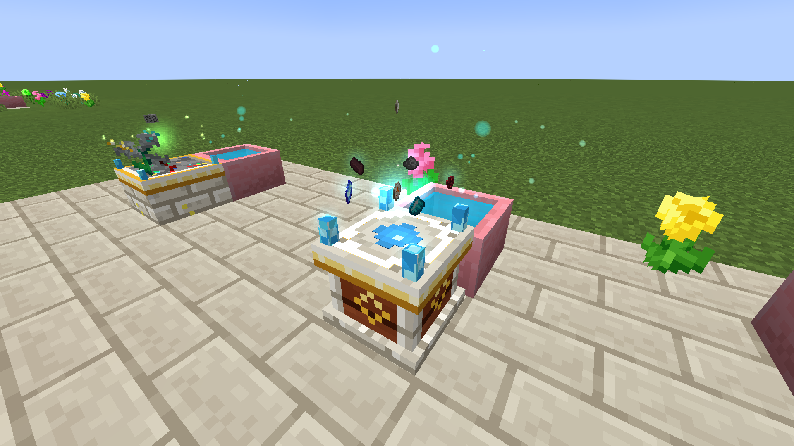

# Heart of Alfheim — Серце Альвгейма (NeoForge 1.20.1, доповнення до Botania)


Доповнення до **Botania** для Minecraft 1.20.1 на NeoForge / Forge (47.x): робота Ботанії, складена в
**окремі блоки-машини**, кожна зі своїм меню й анімаціями. Усі меню — в одному казковому стилі
**«живе дерево»**: дошки живого дерева, вставки з живого каменю, кристали мани на кутах, назва на
табличці з живого каменю.

Це об'єднання двох колишніх модів — **Mana Garden** і **Elven Portal** (старі джари `managarden-*.jar` і
`elvenportal-*.jar` треба прибрати з папки `mods`, їхні блоки тепер тут).

| Блок | Що робить | Готовність |
|---|---|---|
| **Манова оранжерея** | вирощує генеруючі квіти й збирає їхню ману | ✅ |
| **Ельфійський портал** | ельфійські обміни Ботанії й переробка руд за ману | ✅ |
| **Ельфійський рунічний вівтар** | руни й усе інше з рецептів рунічного вівтаря | ✅ |
| **Ельфійська терестріальна плита** | терасталь без іскор і без лазуриту навколо | ✅ |
| **Мановий інфузор** | рецепти басейну мани (манасталь, діаманти й перлини мани, скло...), з каталізаторами | ✅ |
| Чиста ромашка | живий камінь і живе дерево | етап 3 |
| Пелюсткова апотека | функціональні квіти з пелюсток | етап 3 |
| Ферма пелюсток | пелюстки всіх кольорів за ману | етап 3 |



## Манова оранжерея

- **8 грядок** навколо манового серця для генеруючих квітів Ботанії (тег `#botania:generating_special_flowers`,
  а також тег предметів `alfheimheart:greenhouse_flowers`). Квіти ростуть **циклами** й дають ману; кожен різний
  вид понад перший — +5% («гармонія»).
- Мана збирається у сховищі (200 000) і переливається в басейни, розсіювачі й інші приймачі поруч, у приймач,
  прив'язаний **Жезлом лісу**, або заряджає предмет мани в блакитному слоті.
- **Покращення** (4 слоти, до 8 однакових): Швидкості (цикли на 25% швидші), Об'єму (+350 000 мани),
  Удачі (+10% шансу на +50% мани), Врожаю (+15% мани).
- Ліворуч від меню — **хранителька саду**: дихає, кліпає, радіє вдалим циклам і підказує, якщо на неї натиснути.
- Меню відкривається як квітка: бутон розквітає, з нього виростає панель; у скляному серці хвилюється мана,
  краплі течуть лозами від квітів до серця.



## Ельфійський портал

- Ціла **місячна брама** до Альвгейма в одному блоці: 9 слотів для ельфів, 9 — для того, що вони присилають.
- Ельфи обмінюють за **усіма рецептами `botania:elven_trade`** (живе дерево → мрійдерево, манасталь → елементій,
  діаманти мани → драконячий камінь, перлини → пил фей, скло, кварц...) і **переробляють руди** (залізна → 2 сирого
  заліза, золота → 2 сирого золота, мідна → 6 сирої міді, діамантова → 2 діаманти, смарагдова → 2 смарагди,
  редстоунова → 8 редстоуну, лазуритова → 12 лазуриту, вугільна → 2 вугілля, кварцова → 2 кварцу).
- **500 мани** за обмін, до 4 обмінів за секунду; мана з басейнів поруч (до 5 000 за тік) або від розсіювачів.
- Предмети — руками, лійками й трубами, киданням на портал або клацанням по вихору в меню.
- **Анімації:** вихор розкривається в кільці, крутиться, по ньому біжить сяйво; обертається коло рун; мерехтять
  вогники на лозі; кружляють вогники; кристали природи злітають із постаменту; з кожним обміном предмет
  влітає у вихор, вир спалахує, а ельфійський дар вилітає.

| | |
|---|---|
|  |  |
|  |  |

## Машини: вівтар, плита, інфузор

Три машини влаштовані однаково: **9 слотів інгредієнтів** ліворуч, **9 слотів готового** праворуч, сховище мани
(з басейнів мани поруч до кількох тисяч за тік або від розсіювачів, спрямованих на машину), кнопка редстоуну,
компаратор показує запас мани. Предмети — руками, лійками й трубами. Кожен крафт машина заряджає маною потроху;
якщо інгредієнти забрали — мана повертається у сховище.



- **Ельфійський рунічний вівтар** — за всіма рецептами `botania:runic_altar` (руни, покращення оранжереї...),
  живий камінь у слоті під вівтарем (один блок на крафт, як у Ботанії). Руни серед інгредієнтів не витрачаються.
  У меню інгредієнти кружляють навколо вівтаря, у темній западині проступає руна, вісім рун на вівтарі
  загоряються одна за одною, по ободу біжить кільце світла; готова руна вилітає у вихідні слоти. У світі
  інгредієнти кружляють над вівтарем, руна росте над ним, кільце й руни на верху світяться.
- **Ельфійська терестріальна плита** — за рецептами `botania:terra_plate`: злиток манасталі, діамант і перлина мани
  дають терасталь за 500 000 мани (сховище — мільйон). Інгредієнти кружляють і сходяться до центру, там росте куля
  світла — від синього кольору мани до зеленого терасталі, промені «сонця» плити загоряються один за одним,
  над плитою стоїть стовп світла; крафт закінчується зеленим спалахом.
- **Мановий інфузор** — за рецептами `botania:mana_infusion`, до 8 однакових предметів за раз. Слот каталізатора
  під басейном: **алхімічний каталізатор** або **каталізатор закляття** працюють, як блок під басейном мани
  (їхні рецепти мають перевагу). Мана в басейні мерехтить і забарвлюється каталізатором, предмет пливе над нею,
  мана піднімається в нього, після крафту по мані біжить хвиля.

| | |
|---|---|
|  |  |
|  |  |

## Крафти

- **Манова оранжерея** — на верстаті з Серця оранжереї (Терестріальна плита), розсіювача, басейну мани,
  манового скла, мерехтливого живого дерева й цегли з живого каменю; покращення — на Рунічному вівтарі.
- **Ельфійський портал** — на верстаті: пил фей, ельфійське скло, мерехтливе мрійдерево, ядро воріт Альвгейма,
  злитки елементію, пілон природи.
- **Ельфійський рунічний вівтар** — на верстаті: рунічний вівтар, злитки манасталі, діамант мани, цегла з живого
  каменю, дошки живого дерева.
- **Ельфійська терестріальна плита** — на верстаті: плита терестріальної агломерації, злиток терасталі, перлини
  мани, цегла з живого каменю, дошки живого дерева.
- **Мановий інфузор** — на верстаті: басейн мани, злитки манасталі, манове скло, цегла з живого каменю, дошки
  живого дерева.

Усі рецепти є в **Лексиці Ботанії** (розділи «Основи», «Генеруюча флора» й «Альфомантія») і в JEI; стрілки в
меню машин відкривають у JEI їхні рецепти.

## Конфіг

`config/alfheimheart-greenhouse.toml` (цикли, сховище, покращення, швидкості квітів),
`config/alfheimheart-portal.toml` (ціна обміну, запас мани, швидкість, басейни, кинуті предмети) і
`config/alfheimheart-machines.toml` (для кожної машини: сховище, швидкість заряджання, скільки мани брати з басейнів,
найкоротший час крафту; скільки предметів інфузор насичує за раз).

## Залежності

- **Botania** 1.20.1-440 або новіша (їй потрібні Patchouli та Curios).
- JEI — необов'язково.

## Збірка

```
./gradlew build
```

Готовий `.jar` — у `build/libs/`. GitHub Actions збирає мод при кожному пуші (артефакт `alfheimheart-jar`, а також
папка `jars/` у гілці) і знімає скриншоти з гри в `screenshots/`.

Текстури намальовані скриптами в `tools/` (Python + Pillow): `tools/lib/wood.py` — спільний стиль «живе дерево»;
`tools/greenhouse/` і `tools/portal/` — панелі меню, віджети, блоки, моделі, хранителька, логотип; `tools/machines/` —
спільний аркуш віджетів, панелі, блоки й моделі машин (`preview_model.py` показує моделі блоків). `check_layout.py`
у кожній папці перевіряє, що код меню і текстури збігаються.
