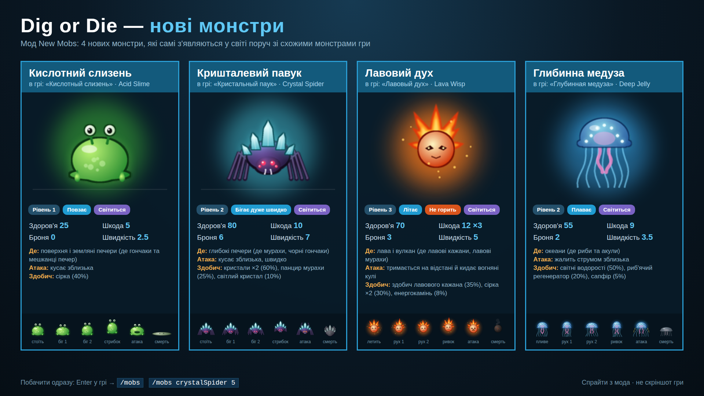
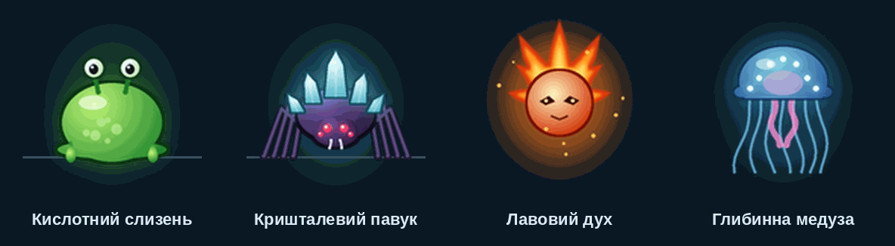

# Dig or Die — нові монстри (New Mobs)

BepInEx-мод для [Dig or Die](https://store.steampowered.com/app/315460/Dig_or_Die/), що додає 4 нових монстри.
Вони з'являються у світі самі — там, де живуть схожі монстри гри.





| Монстр | Тип | HP | Шкода | Броня | Де з'являється | Здобич |
| --- | --- | --- | --- | --- | --- | --- |
| Кислотний слизень (Acid Slime) | повзає, рівень 1 | 25 | 5 | 0 | поверхня, земляні печери (з гончаками й мешканцями печер) | сірка |
| Кришталевий павук (Crystal Spider) | бігає дуже швидко, рівень 2 | 80 | 10 | 6 | глибокі печери (з мурахами, чорними гончаками) | кристали, панцир мурахи, світлий кристал |
| Лавовий дух (Lava Wisp) | літає, стріляє вогняними кулями, не горить, рівень 3 | 70 | 12 ×3 | 3 | лава й вулкан (з лавовими кажанами й мурахами) | здобич лавового кажана, сірка, енергокамінь |
| Глибинна медуза (Deep Jelly) | плаває, рівень 2 | 55 | 9 | 2 | океани (з рибами й акулами) | світні водорості, риб'ячий регенератор, сапфір |

Усі монстри світяться в темряві. У грі їхні назви — російською (якщо гра російською) або англійською:
шрифт гри не має українських літер.

## Встановлення

Архів [`jars/DigOrDie-NewMobs.zip`](../jars/DigOrDie-NewMobs.zip): розпакувати, закрити гру, запустити `Install.bat`,
грати **через Steam**. Встановлювач той самий, що в менеджера модів: ставить BepInEx, мод і завантажує з nuget.org
бібліотеку [DODModAPI](https://github.com/ddmitv/dig-or-die-mods) (її не можна класти в архів — автор не дав ліцензії
на поширення).

## Команди (чит, вимикає досягнення)

```
/mobs                       список нових монстрів
/mobs acidSlime             поставити монстра поруч
/mobs crystalSpider 5       кілька одразу (до 20)
```

## Налаштування

`BepInEx/config/reya.digordie.newmobs.cfg`, розділ `[Spawn]`: для кожного монстра число від 0 (не з'являється сам)
до 5 (часто), за замовчуванням 1 — так само часто, як один зі звичайних монстрів того місця.

## Як це працює

- `src/DigOrDieMobs/Mobs.cs` — описи монстрів: звичайні класи гри `CUnitGround` / `CUnitBird` / `CUnitFish`
  (ходить, літає, плаває) з новими характеристиками, здобиччю й світлом. Реєструються через `DODModAPI.UnitManager`.
- Спрайти малює `tools/draw_mobs.py` (128×128, кадри: стоїть, біг ×2, стрибок, атака, смерть; симетричні, тож
  дивляться правильно в будь-який бік). `DigOrDie.DODModAPI.AssetPacker` пакує їх в атлас усередині dll.
- Природна поява: патч на `GetMonstersList` режимів гри — новий монстр додається до списку, якщо в ньому є
  його «сусіди» з ванільної гри.
- Лавовий дух стріляє ванільними `GBullets.fireballSmall`.

## Збірка

```
cd digordie-mobs
dotnet build -c Release          # -> dist/DigOrDie-NewMobs.zip
python3 tools/draw_mobs.py       # (за потреби) перемалювати спрайти; потрібні Pillow і numpy
```

## Обмеження

- У мультиплеєрі мод потрібен усім гравцям.
- Перевірено збіркою й тестами логіки, але не в самій грі: розмір спрайта на екрані та баланс можуть потребувати
  підкручування після першого запуску.
