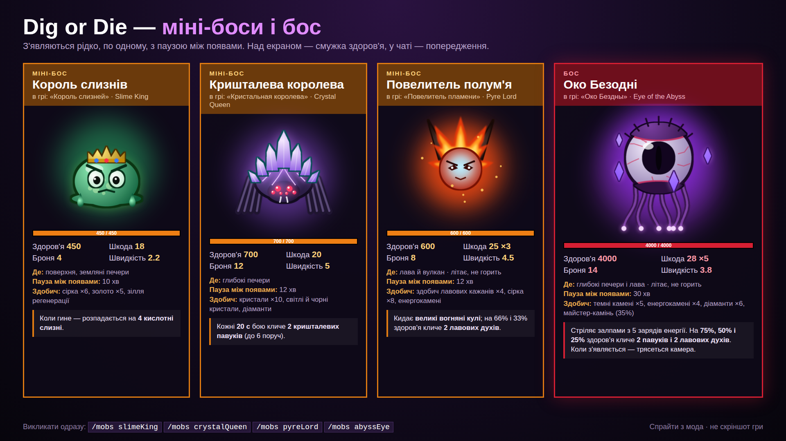
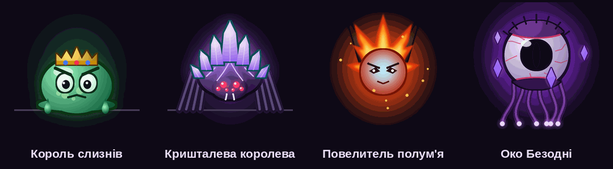
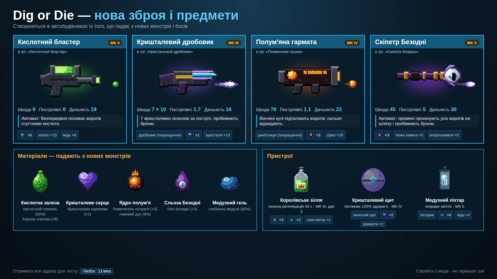
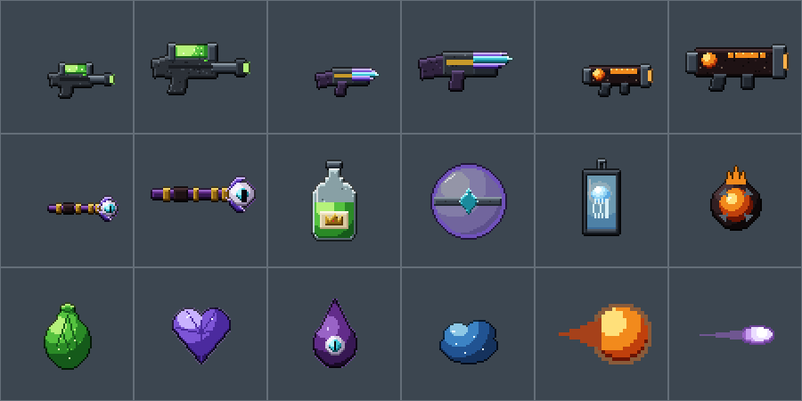

# Dig or Die — нові монстри (New Mobs)

BepInEx-мод для [Dig or Die](https://store.steampowered.com/app/315460/Dig_or_Die/), що додає 4 нових монстри,
3 міні-боси, боса, а ще нову зброю і предмети з їхньої здобичі.
Вони з'являються у світі самі — там, де живуть схожі монстри гри.


| Монстр | Тип | HP | Шкода | Броня | Де з'являється | Здобич |
| --- | --- | --- | --- | --- | --- | --- |
| Кислотний слизень (Acid Slime) | повзає, рівень 1 | 25 | 5 | 0 | поверхня, земляні печери (з гончаками й мешканцями печер) | сірка |
| Кришталевий павук (Crystal Spider) | бігає дуже швидко, рівень 2 | 80 | 10 | 6 | глибокі печери (з мурахами, чорними гончаками) | кристали, панцир мурахи, світлий кристал |
| Лавовий дух (Lava Wisp) | літає, стріляє вогняними кулями, не горить, рівень 3 | 70 | 12 ×3 | 3 | лава й вулкан (з лавовими кажанами й мурахами) | здобич лавового кажана, сірка, енергокамінь |
| Глибинна медуза (Deep Jelly) | плаває, рівень 2 | 55 | 9 | 2 | океани (з рибами й акулами) | світні водорості, риб'ячий регенератор, сапфір |

## Міні-боси і бос





| | Ранг | HP | Шкода | Броня | Де | Особливість | Пауза між появами |
| --- | --- | --- | --- | --- | --- | --- | --- |
| Король слизнів (Slime King) | міні-бос | 450 | 18 | 4 | поверхня, земляні печери | гине — розпадається на 4 кислотні слизні | 10 хв |
| Кришталева королева (Crystal Queen) | міні-бос | 700 | 20 | 12 | глибокі печери | кожні 20 с бою кличе 2 павуків (до 6 поруч) | 12 хв |
| Повелитель полум'я (Pyre Lord) | міні-бос | 600 | 25 ×3 | 8 | лава, вулкан | великі вогняні кулі, на 66% і 33% HP кличе 2 лавових духів | 12 хв |
| Око Безодні (Eye of the Abyss) | **бос** | 4000 | 28 ×5 | 14 | глибокі печери, лава | залпи енергії, на 75/50/25% HP кличе 2 павуків і 2 духів | 30 хв |

Боси з'являються самі в своїх місцях, але кожен — лише один одночасно і не частіше, ніж раз на свою паузу
(відлік іде від запуску гри). Коли бос поруч — угорі екрана смужка здоров'я (червона в боса, помаранчева в міні-босів),
у чаті — попередження, а поява Ока Безодні ще й трясе камеру.

Усі монстри світяться в темряві. У грі їхні назви — російською (якщо гра російською) або англійською:
шрифт гри не має українських літер.

## Нова зброя і предмети





Створюються в автобудівниках (рівень у дужках) з матеріалів, що падають із нових монстрів:

| Зброя | Рецепт | Що робить |
| --- | --- | --- |
| Кислотний бластер (MK II) | кислотна залоза ×6, залізо ×10, мідь ×6 | автомат, 9 шкоди, ~8 пострілів/с |
| Кришталевий дробовик (MK III) | дробовик + кришталеве серце + кристали ×15 | 7 осколків по 10, пробивають броню |
| Полум'яна гармата (MK IV) | ракетниця + ядро полум'я ×3 + сірка ×20 | вогняні кулі на 70, підпалюють |
| Скіпетр Безодні (MK V) | сльоза Безодні ×3, темні камені ×5, енергокамені ×5 | автомат, 45 шкоди, промені пронизують усіх ворогів |

| Предмет | Рецепт | Що робить |
| --- | --- | --- |
| Королівське зілля (MK III, ×2) | кислотна залоза ×3, медузний гель ×2, синя квітка ×2 | сильна регенерація на 45 с |
| Кришталевий щит (MK IV) | захисний щит + кришталеве серце ×2 + діаманти ×2 | щит, що поглинає 125% здоров'я |
| Медузний ліхтар (MK II) | ліхтарик + медузний гель ×4 + мідь ×4 | яскраве світло |

Матеріали: **кислотна залоза** (кислотний слизень 50%, Король слизнів ×6), **кришталеве серце** (Кришталева
королева ×2), **ядро полум'я** (Повелитель полум'я ×3, лавовий дух 8%), **сльоза Безодні** (Око Безодні ×3),
**медузний гель** (глибинна медуза 60%).

## Встановлення

Архів [`jars/DigOrDie-NewMobs.zip`](../jars/DigOrDie-NewMobs.zip): розпакувати, закрити гру, запустити `Install.bat`,
грати **через Steam**. Встановлювач той самий, що в менеджера модів: ставить BepInEx, мод і завантажує з nuget.org
бібліотеку [DODModAPI](https://github.com/ddmitv/dig-or-die-mods) (її не можна класти в архів — автор не дав ліцензії
на поширення).

## Команди (чит, вимикає досягнення)

```
/mobs                       список нових монстрів і босів
/mobs acidSlime             поставити монстра поруч
/mobs crystalSpider 5       кілька одразу (до 20)
/mobs abyssEye              викликати боса (slimeKing, crystalQueen, pyreLord — міні-боси)
/mobs items                 покласти в інвентар усі нові предмети і зброю
```

## Налаштування

`BepInEx/config/reya.digordie.newmobs.cfg`:
- `[Spawn]` — для кожного монстра число від 0 (не з'являється сам) до 5 (часто), за замовчуванням 1 — так само часто,
  як один зі звичайних монстрів того місця;
- `[Bosses]` — `<бос>Enabled` (чи з'являється сам) і `<бос>CooldownMinutes` (пауза між появами в хвилинах гри).

## Як це працює

- `src/DigOrDieMobs/Mobs.cs` — описи монстрів: звичайні класи гри `CUnitGround` / `CUnitBird` / `CUnitFish`
  (ходить, літає, плаває) з новими характеристиками, здобиччю й світлом. Реєструються через `DODModAPI.UnitManager`.
- Спрайти малює `tools/draw_mobs.py` (128×128, кадри: стоїть, біг ×2, стрибок, атака, смерть; симетричні, тож
  дивляться правильно в будь-який бік). `DigOrDie.DODModAPI.AssetPacker` пакує їх в атлас усередині dll.
- Природна поява: патч на `GetMonstersList` режимів гри — новий монстр додається до списку, якщо в ньому є
  його «сусіди» з ванільної гри.
- Лавовий дух стріляє ванільними `GBullets.fireballSmall`, Повелитель полум'я — `fireballBig`, Око Безодні — `particleMedium`.
- `BossBehaviour.cs`: після кожного кроку симуляції (`SUnits.OnUpdateSimu`) перевіряє живих босів — хвилі помічників
  на порогах здоров'я, періодичний виклик, розпад після смерті (лише на хості / в одиночній грі). Патч на
  `SUnits.SpawnUnit_Local` запускає паузу між появами й пише попередження. Боси — звичайні `CUnitGround`/`CUnitBird`
  з великими характеристиками, а не ванільні `CUnitBoss`: ті прив'язані до зон зі сталими координатами світу.
- `BossBar.cs`: смужка здоров'я найближчого боса (Unity IMGUI).
- `Items.cs`: предмети через `DODModAPI.ItemManager` — звичайні класи гри `CItem_Weapon` / `CItem_Device` /
  `CItem_Material` з рецептами в автобудівниках; кулі — `ModBulletDesc` з власними спрайтами. Спрайти — піксель-арт
  у стилі гри: `tools/draw_items.py` малює їх на полотні 64×64 рушієм `tools/pixel.py` (4 тони на матеріал, світло
  зліва згори, темний контур 1 px) і збільшує ×2 (зброя: `tile` — у руці, `icon` — в інвентарі).

## Збірка

```
cd digordie-mobs
dotnet build -c Release          # -> dist/DigOrDie-NewMobs.zip
python3 tools/draw_mobs.py       # (за потреби) перемалювати монстрів; потрібні Pillow і numpy
python3 tools/draw_items.py      # (за потреби) перемалювати предмети
```

## Обмеження

- У мультиплеєрі мод потрібен усім гравцям.
- Збереження з новими предметами чи монстрами без мода не відкриються коректно — не видаляйте мод зі світу, де вони є.
- Перевірено збіркою й тестами логіки, але не в самій грі: розмір спрайта на екрані та баланс можуть потребувати
  підкручування після першого запуску.
