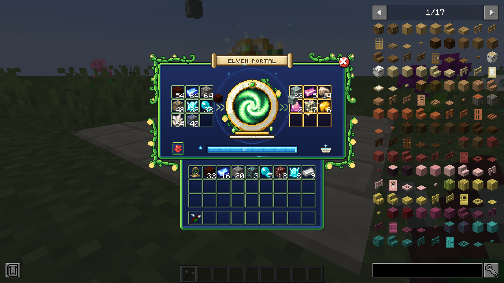
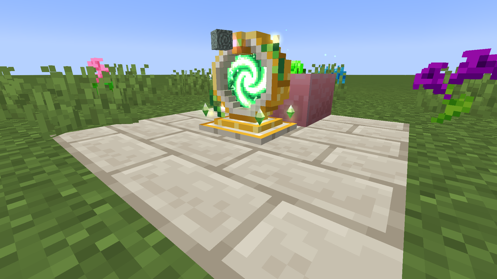
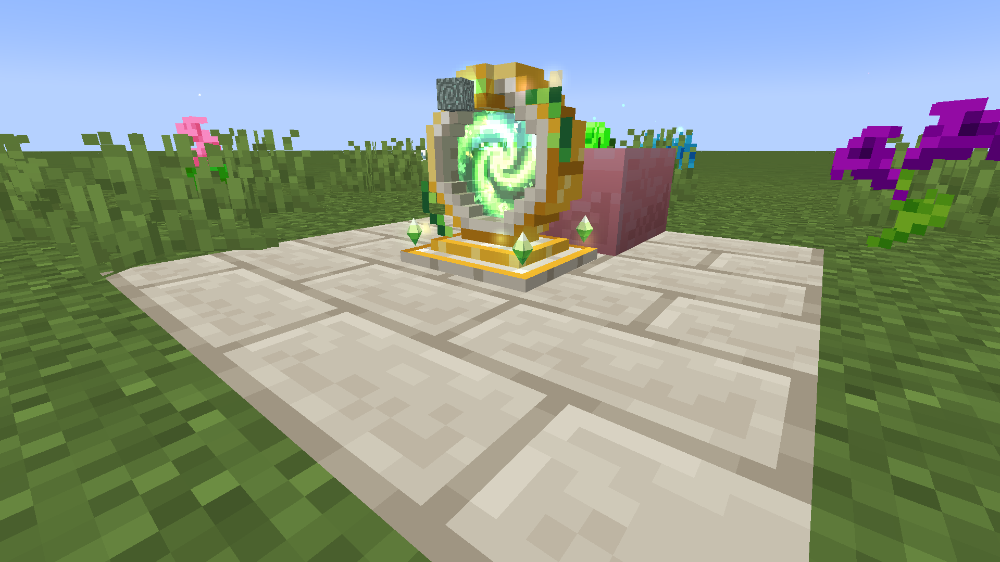
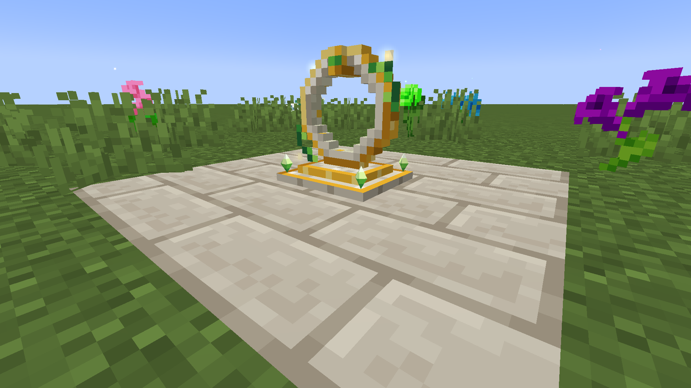
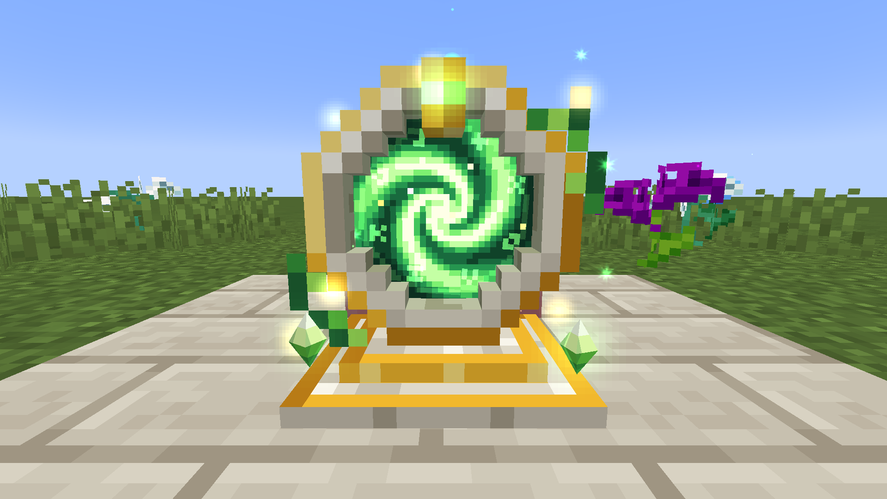
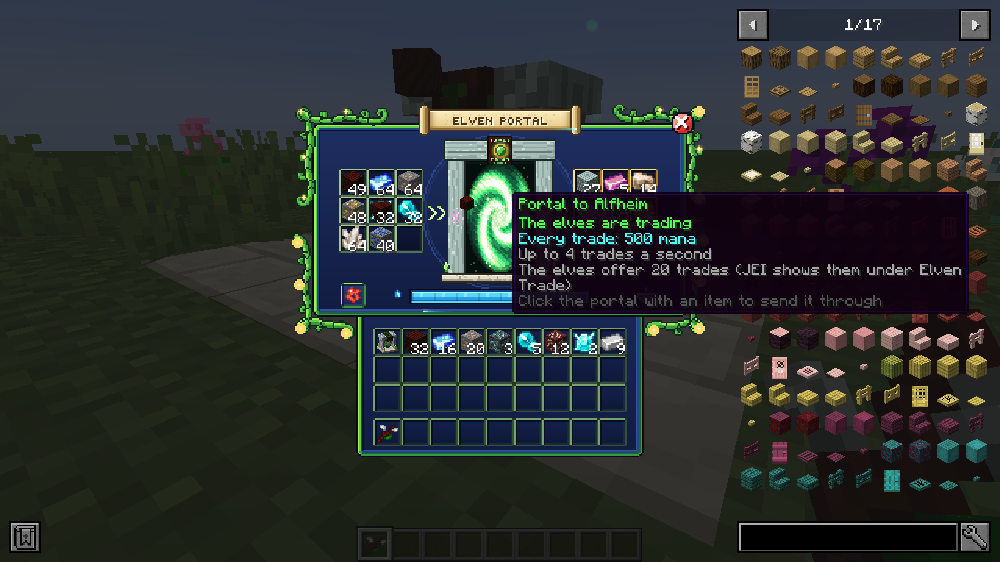
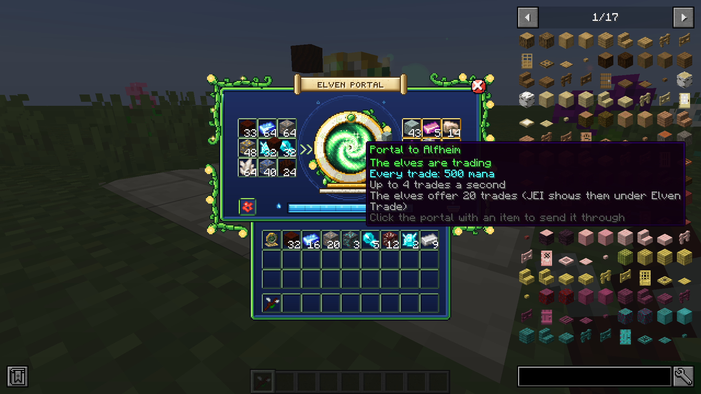
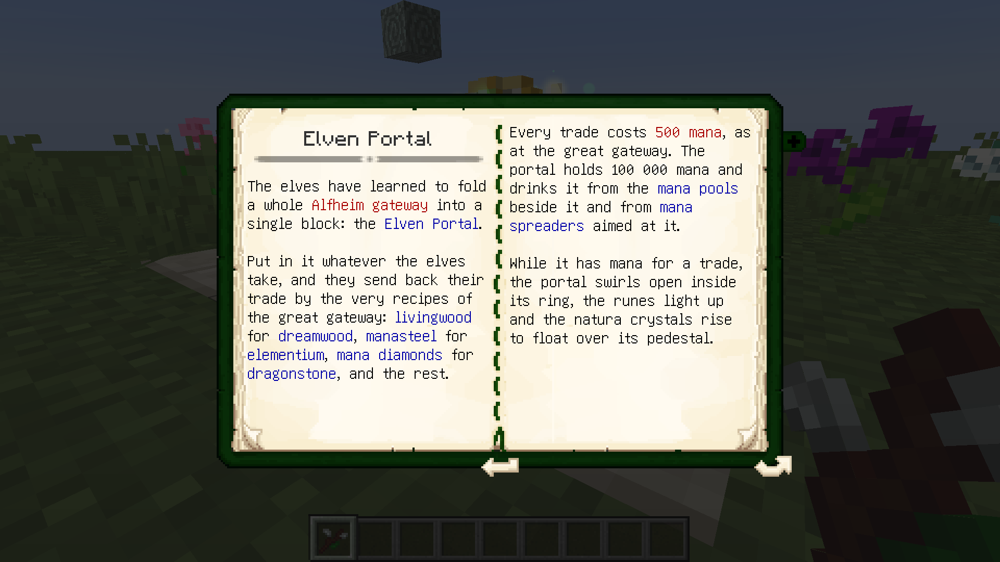
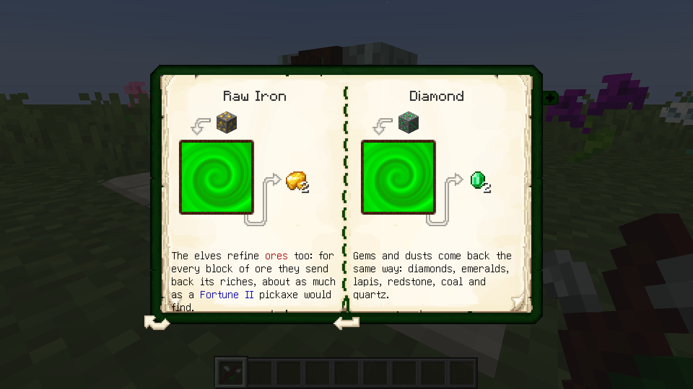

# Elven Portal — Ельфійський портал (NeoForge 1.20.1, доповнення до Botania)


Доповнення до **Botania** для Minecraft 1.20.1 на NeoForge (47.1.x): цілий портал до Альвгейма, складений
в **один блок**. Кладеш у нього предмети — ельфи обмінюють їх за тими самими рецептами, що й великі
ворота Альвгейма (живе дерево → мрійдерево, манасталь → елементій, манові діаманти → драконячий камінь...),
а ще **переробляють руди** на сировину. Працює на мані з басейнів поруч або з розсіювачів.



## Ельфійський портал

- **9 слотів для ельфів** (зліва) і **9 слотів для того, що вони присилають** (справа, із золотою обвідкою).
- Ельфи обмінюють за **усіма рецептами типу `botania:elven_trade`**: Ботанії, цього мода й будь-яких
  інших модів чи збірок. Зокрема:

  | Віддаєш | Отримуєш |
  |---|---|
  | живе дерево, колоди живого дерева | мрійдерево, колоди мрійдерева |
  | 2 злитки манасталі (2 блоки) | злиток (блок) елементію |
  | мановий діамант (блок) | драконячий камінь (блок) |
  | манова перлина | пил фей |
  | манове скло | ельфійське скло |
  | кварц | ельфійський кварц |

- **Руди** (рецепти цього мода, приблизно як кирка з Удачею II):

  | Руда (звичайна й глибинна) | Отримуєш |
  |---|---|
  | залізна | 2 сирого заліза |
  | золота | 2 сирого золота |
  | незерська золота | 1 сире золото |
  | мідна | 6 сирої міді |
  | вугільна | 2 вугілля |
  | редстоунова | 8 редстоуну |
  | лазуритова | 12 лазуриту |
  | діамантова | 2 діаманти |
  | смарагдова | 2 смарагди |
  | кварцова (Незер) | 2 кварцу |

  Руди беруться з тегів `forge:ores/...`, тож підходять і руди з інших модів у цих тегах.
- Кожен обмін коштує **500 мани** (як у великих воротах), до **4 обмінів за секунду**. Портал вміщує
  100 000 мани й бере її з **басейнів мани** на будь-якій із шести сторін (до 5 000 за тік) та від
  **розсіювачів мани**, спрямованих на нього.
- Предмети потрапляють усередину: руками (Shift+клік теж), **лійками й трубами** (кладуть у ліві слоти,
  забирають із правих), **киданням** на портал, або в меню — **клацанням по вихору порталу** предметом
  на курсорі.
- Те, що ельфи лише повертають (залізо, діаманти, перлини Енду), портал не бере зовсім.
- Кнопка **редстоуну**: працює завжди / лише з сигналом / лише без сигналу.
- Компаратор показує, скільки мани всередині; **Жезл лісу** показує ману в HUD. Ламається сокирою,
  предмети випадають, а мана лишається в блоці.
- У **Лексиці Ботанії** (розділ «Альфомантія», з'являється після відкриття справжнього порталу) є
  сторінка про портал із рецептом і обмінами руд — англійською, українською й російською.
- **JEI** (необов'язково): портал показано серед «Ельфійських обмінів», а стрілки в меню відкривають усі
  обміни; панелі JEI не накладаються на лози й сувій меню.

## Крафт

На верстаті — з дарів самих ельфів, тож спершу треба збудувати справжні ворота Альвгейма:

```
П С П    П — пил фей                   С — ельфійське скло
М Я М    М — мерехтливе мрійдерево      Я — ядро воріт Альвгейма
Е Н Е    Е — злиток елементію           Н — пілон природи
```

## Як це виглядає

- У світі це **ельфійська місячна брама**: кільце з кремового каменю із золотим обідком, обвите лозою з
  золотими вогниками, із зеленим самоцвітом угорі, на двоступеневому постаменті.
- **Анімації в світі:** коли порталу вистачає мани, у кільці розкривається зелений вихор (трохи більшим
  за свій розмір і назад), його спіральні рукави крутяться, по ньому пробігає сяйво; усередині кільця
  повільно обертається коло рун; самоцвіт світиться; навколо кільця кружляють три вогники; чотири кристали
  природи на кутах постаменту здіймаються, ширяють і обертаються. З кожним обміном предмет влітає у вихор,
  вир спалахує, розлітаються іскри, а те, що прислали ельфи, вилітає з нього. Коли мана скінчилася, вихор
  стягується в ніщо, а кристали опускаються.
- Меню в тому ж казковому стилі, що й у Мановому саду: темно-синя панель із зеленим краєм, завиті лози,
  золоті вогники, назва на пергаментному сувої, червона кнопка ✕. Посередині — та сама брама з живим
  вихором; самоцвіт угорі показує стан: **зелений** — ельфи обмінюють, **золотий** — чекає,
  **червоний** — бракує мани або повні вихідні слоти, **сірий** — зупинений редстоуном.
- Руни на кільці меню світяться, а поки ельфи обмінюють, світло біжить по них колом; кристали на
  постаменті здіймаються, коли портал відчиняється. З кожним обміном стрілки спалахують, предмет летить зі
  слотів ліворуч у портал, а те, що прислали ельфи, вилітає з нього до золотих слотів праворуч; мана біжить
  по жилці рамки, у вихор затягує золоті й рожеві іскри.
- Меню відкривається як портал: посередині розкривається вихор, із нього виростає панель; при закритті
  панель згортається назад у вихор.

| | |
|---|---|
|  |  |
|  |  |
|  |  |
|  |  |

## Конфіг

`config/elvenportal-common.toml`: ціна обміну (`manaPerTrade`), запас мани (`capacity`), тіки між обмінами
(`tradeTicks`), чи брати ману з басейнів поруч (`drawFromPools`) і скільки за тік (`drawPerTick`), чи
приймати кинуті предмети (`acceptThrownItems`).

## Залежності

- **Botania** 1.20.1-440 або новіша (їй потрібні Patchouli та Curios).
- JEI — необов'язково.

## Збірка

```
./gradlew build
```

Готовий `.jar` — у `build/libs/`. GitHub Actions збирає мод при кожному пуші (артефакт `elvenportal-jar`,
а також папка `jars/` у гілці) і знімає скриншоти з гри в `screenshots/`.

Текстури намальовані скриптами в `tools/` (Python + Pillow): `gen_gui.py` (панель меню з брамою),
`gen_widgets.py` (кнопки, самоцвіти, руни, кристали, сувій і кадри вихору для меню), `gen_block.py` (текстури брами
та вихору, рун і сяйва для рендера блока; `--preview` показує браму спереду), `gen_models.py` (модель брами піксель
у піксель), `gen_logo.py` (логотип). Кольори лежать у `tools/style.py`, лози малює `tools/vines.py`, вихор —
`tools/swirl.py`. `tools/check_layout.py` перевіряє, що код меню і текстури збігаються.
