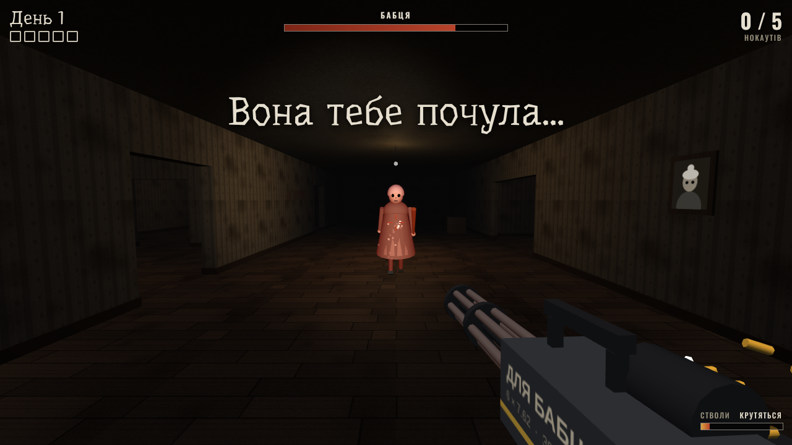
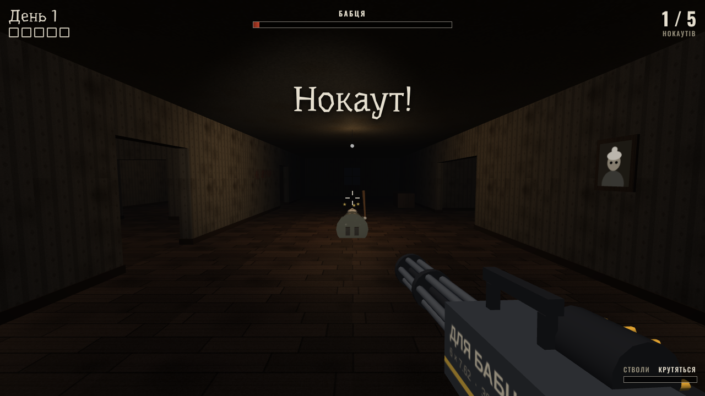
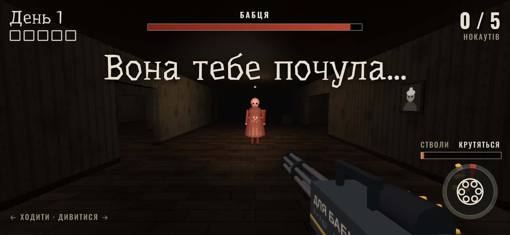

# Бабця з мініганом

Неофіційна фан-демка в дусі мобільного хорору Granny: темна хата, Бабця з битою і шестиствольний мініган від першої особи.
Усе зроблено з нуля (three.js, процедурні текстури, синтезовані звуки), без файлів оригінальної гри.

Грати: відкрий `index.html` у браузері або артефакт https://claude.ai/artifact/D7Y2iQtzATu6VhrertKmrR

## Що в моді
- **Мініган**: стволи розкручуються ~0.5 с, далі 25 пострілів/с; трасери, спалах, гільзи, віддача, дірки в стінах.
- **Перегрів**: ~5 с безперервної стрільби, потім стволи світяться й треба дати їм охолонути.
- **Бабця** ходить по хаті за маршрутом через двері, сповільнюється від влучань, у голову шкода подвійна.
  Після нокауту лежить 10 с і встає швидшою.
- **Мета**: 5 нокаутів, поки не минуло 5 днів. Підпустиш її впритул — втрачаєш день і прокидаєшся в спальні.

## Керування
| ПК | Телефон |
|---|---|
| WASD — ходити | лівий палець — джойстик |
| миша — дивитися | правий палець — огляд |
| ЛКМ (тримати) — стріляти | кнопка ⦿ — стріляти (можна вести пальцем) |

