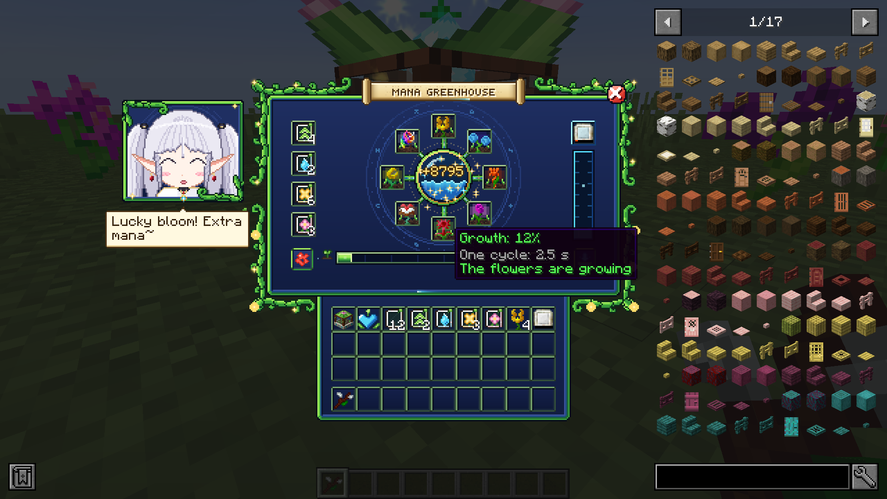
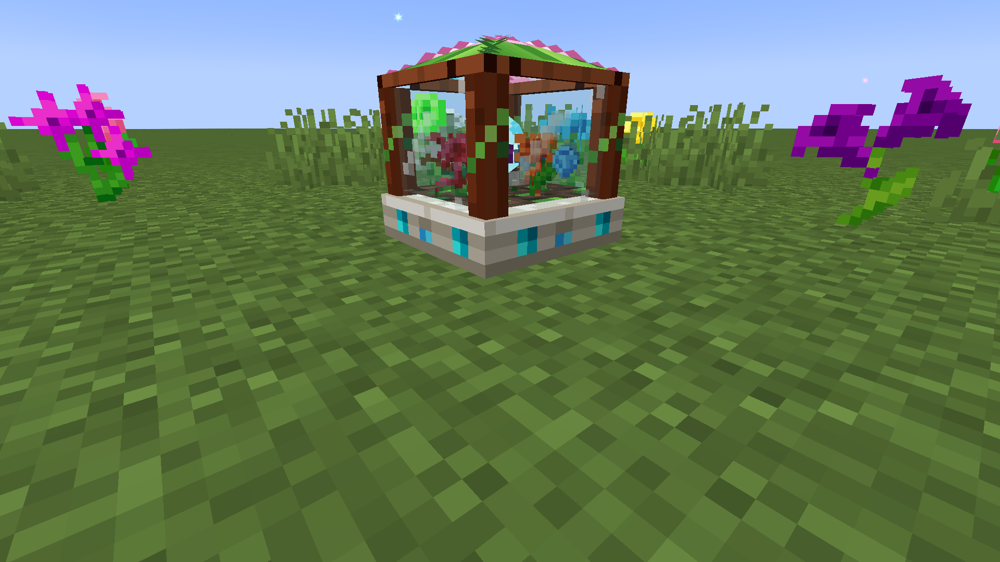
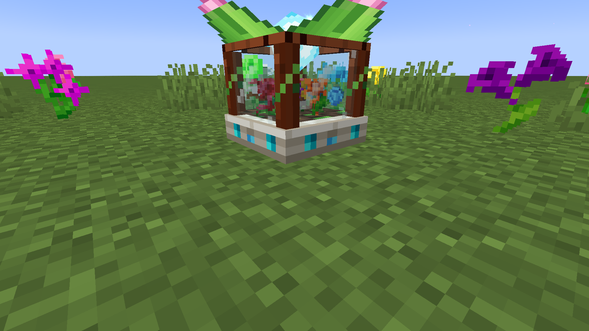
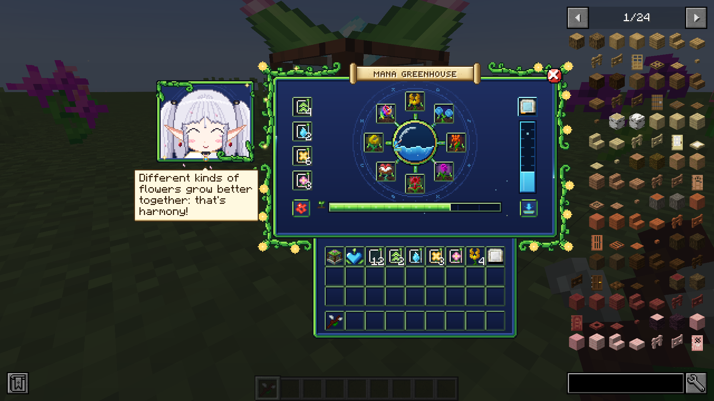
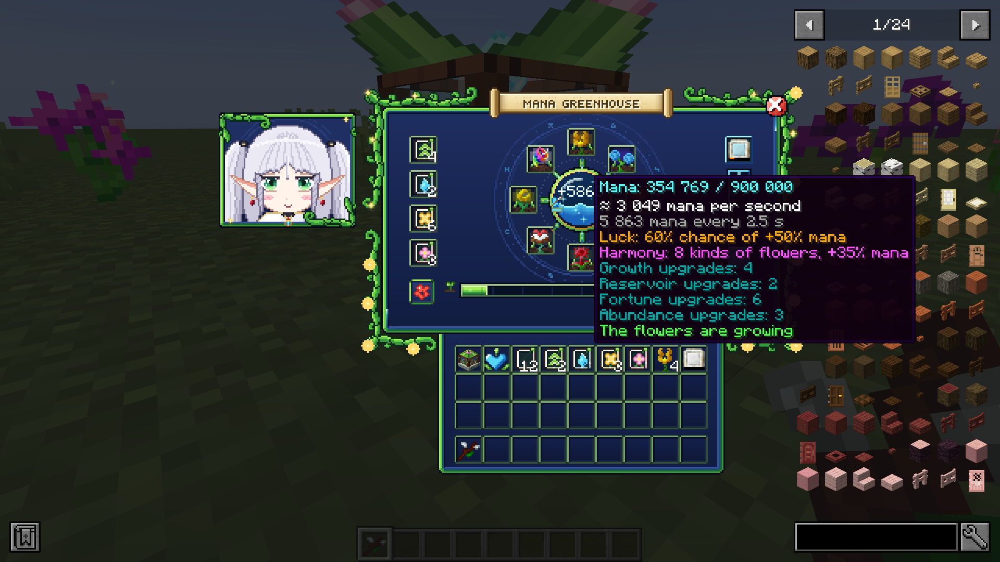
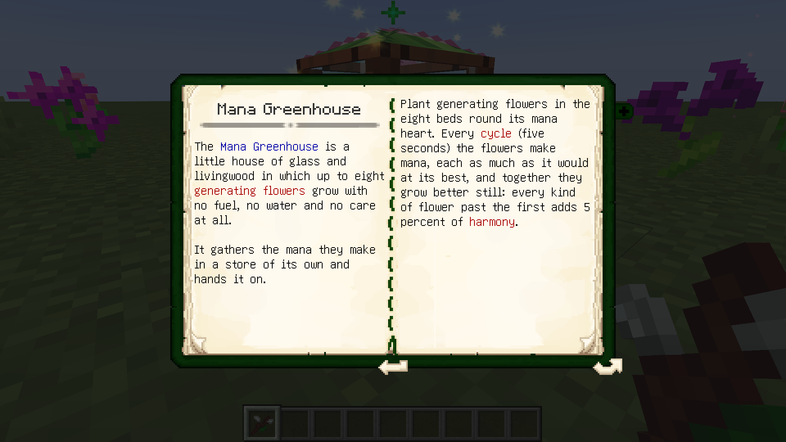
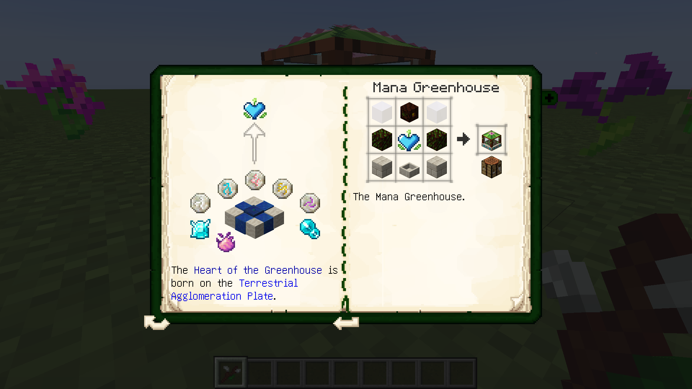

# Mana Garden — Мановий сад (NeoForge 1.20.1, доповнення до Botania)


Доповнення до **Botania** для Minecraft 1.20.1 на NeoForge (47.1.x). Воно спрощує здобуття мани:
один блок, **Манова оранжерея**, вирощує всередині до восьми генеруючих квітів без палива, води
й догляду, накопичує їхню ману та віддає її далі. Зате крафт у неї складний: щоб її зробити,
треба пройти Ботанію аж до Терестріальної плити.



## Манова оранжерея

- **8 грядок** навколо манового серця. Садиш будь-які генеруючі квіти Ботанії (Жаржина, Гідрогортензія,
  Термолілія, Таємнича троянда, Munchdew, Kekimurus, Gourmaryllis, Spectrolus, Dandelifeon... і їхні
  плавучі версії) — усе з тегу `#botania:generating_special_flowers`. Інші квіти можна пустити через тег
  предметів `managarden:greenhouse_flowers`.
- Квіти ростуть **циклами** (5 с без покращень). Кожен цикл дає ману: швидкість квітки × тривалість циклу.
- **Гармонія**: кожен різний вид квітки понад перший дає +5% мани.
- Мана збирається в сховищі (200 000 без покращень) і:
  - сама переливається в басейни мани, розсіювачі та інші приймачі мани поруч (до 5 000 за тік);
  - або в приймач, прив'язаний **Жезлом лісу** (режим прив'язки: Shift+ПКМ по оранжереї, потім по басейну,
    до 12 блоків);
  - заряджає предмет мани в блакитному слоті (планшет мани, дзеркало, каблучки...).
- Кнопки в меню: **редстоун** (працює завжди / лише з сигналом / лише без сигналу) і **віддача мани**
  (увімкнути/вимкнути; Shift+клік — відв'язати від приймача).
- Компаратор показує, наскільки повне сховище. Жезл лісу показує ману в HUD.
- Ламається сокирою; квіти й покращення випадають, а мана лишається в предметі й повертається, коли його
  знову поставити.
- У **Лексиці Ботанії** (розділ «Генеруюча флора») є сторінки про оранжерею та покращення з усіма рецептами
  (англійською, українською й російською).

Швидкості квітів усередині (мана за секунду, змінюються в конфігу):

| Квітка | Мана/с | Квітка | Мана/с |
|---|---|---|---|
| Гідрогортензія (Hydroangeas) | 10 | Narslimmus | 110 |
| Жаржина (Endoflame) | 24 | Kekimurus | 130 |
| Таємнича троянда (Rosa Arcana) | 45 | Spectrolus | 150 |
| Термолілія (Thermalily) | 60 | Entropinnyum | 180 |
| Munchdew | 80 | Rafflowsia | 200 |
| Gourmaryllis | 100 | Dandelifeon | 260 |
| інші | 20 | Shulk Me Not | 400 |

## Покращення

Чотири слоти зліва. Покращення одного виду складаються, діють до 8 однакових.

| Покращення | Що дає (кожне) |
|---|---|
| **Швидкості** (Growth) | цикли на 25% швидші |
| **Об'єму мани** (Reservoir) | +350 000 мани в сховищі |
| **Удачі** (Fortune) | +10% шансу, що цикл дасть на 50% більше мани |
| **Врожаю** (Abundance) | +15% мани кожен цикл |

## Крафти

1. **Серце оранжереї** — на *Терестріальній плиті* (300 000 мани): руни Весни, Літа, Осені, Зими й Мани,
   мановий діамант, манова перлина, пил фей.
2. **Манова оранжерея** — на верстаті:
   ```
   Г Р Г    Г — манове скло            Р — розсіювач мани
   Д С Д    Д — мерехтливе живе дерево  С — Серце оранжереї
   К Б К    К — цегла з живого каменю   Б — басейн мани
   ```
3. **Порожня квіткова табличка** (×2) — на верстаті: полірований живий камінь по кутах, манасталь хрестом,
   манова перлина в центрі.
4. **Покращення** — на *Рунічному вівтарі*, з порожньої таблички:
   - Швидкості (16 000 мани): руни Повітря, Весни, Літа, 2 манового пилу, 2 цукру, світлопил;
   - Об'єму мани (20 000): руни Води, Мани, Зими, планшет мани, 2 манові діаманти;
   - Удачі (20 000): руни Землі, Весни, Жадібності, кроляча лапка, 2 золоті злитки, пил фей;
   - Врожаю (20 000): руни Осені, Землі, Ненажерливості, 2 добрива, мановий діамант, золота морква.

## Як це виглядає

- Крізь скло оранжереї видно посаджені квіти; при кожному циклі над нею злітають іскри мани
  (золоті — коли цикл вдалий).
- Коли меню відкрите, бутон на даху розпускається, а всередині піднімається кристал мани.
- Меню відкривається як квітка: бутон у центрі розквітає, з нього виростає панель, інвентар під нею
  розгортається як сувій, розлітаються пелюстки, і прибігає **хранителька саду** — маленька ельфійка-
  чарівниця з довгими білими хвостиками, спокійними зеленими очима й червоними сережками, у білому
  пальті з пелериною й золотою облямівкою, чорних колготках і коричневих чоботях, з посохом із червоною
  сферою; над її долонею пливе Серце оранжереї. Вона махає рукою, дихає, кліпає, серце світиться, коли
  надходить мана, вона піднімає його при вдалому циклі, а якщо на неї натиснути — підказує, чого бракує
  оранжереї.
- У скляному серці хвилюється мана з бульбашками, краплі мани течуть лозами від квітів до серця,
  світло біжить по мановій жилці рамки; при закритті панель згортається назад у серце.

| | |
|---|---|
|  |  |
|  |  |
|  |  |

## Конфіг

`config/managarden-common.toml`: тривалість циклу, сховище, сила кожного покращення, максимум однакових
покращень, шанс і бонус удачі, гармонія, швидкість віддачі й заряджання, радіус прив'язки та швидкість кожної
квітки (`flowerRates`, у форматі `"botania:endoflame=24"`).

## Залежності

- **Botania** 1.20.1-440 або новіша (їй потрібні Patchouli та Curios).
- JEI — необов'язково; якщо є, його панелі не накладаються на хранительку й таблички меню.

## Збірка

```
./gradlew build
```

Готовий `.jar` — у `build/libs/`. GitHub Actions збирає мод при кожному пуші (артефакт `managarden-jar`,
а також папка `jars/` у гілці) і знімає скриншоти з гри в `screenshots/`.

Текстури намальовані скриптами в `tools/` (Python + Pillow): `gen_gui.py`, `gen_widgets.py`, `gen_mascot.py`,
`gen_block.py`, `gen_items.py`. `tools/check_layout.py` перевіряє, що код меню і текстури збігаються.
